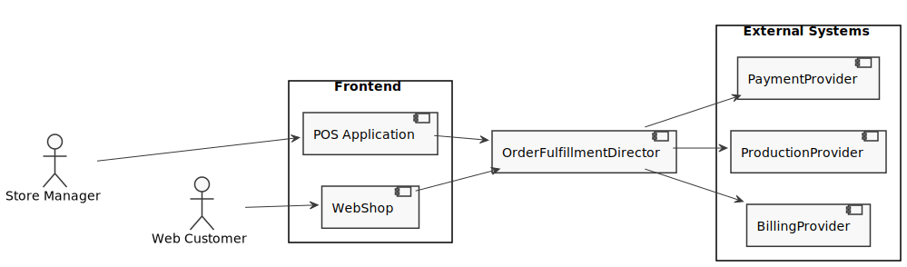
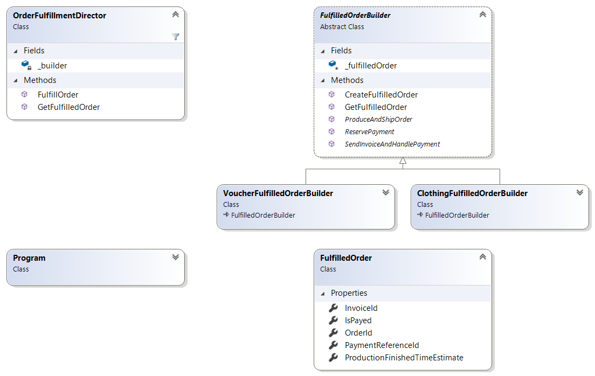

# Overview

In this kata you implement the Gang of Four Builder Pattern [[1](#ref-1), [2](#ref-2), [3](#ref-3)].

Assume you are programming a shop system to sell clothes. The users of your system are store managers ordering items via an application on the point of sales computer of the stores (POS Application). In addition you provide a WebShop for online sales. Both the POS Application and the WebShop send the orders to a backend service, the `OrderFulfillmentDirector`. This service executes the steps to fulfill an order by delegating the work to special services `PaymentProvider`, `ProductionProvider` and `BillingProvider`.

## Scope of the Kata

Please implement the high level backend `OrderFulfillmentDirector` for the clothes shop.

The director method `FulfillOrder` usually would take in order details from the frontend as a parameter, but for sake of simplicity we leave this out. The `OrderFulfillmentDirector` shall use a `builder` member to construct `FulfilledOrder` objects. The `builder` is an instance of a class inheriting the abstract class `FulfilledOrderBuilder`.

For the kata we consider two different concrete `FulfilledOrderBuilder` classes:

* The `ClothingFulfilledOrderBuilder` shall handle an order for clothes which need to me manufactured.

* The `VoucherFulfilledOrderBuilder` shall handle an order for a voucher purchased in the online store e.g. intended as a present for someone else.

Each `builder` implements the following steps needed to fulfill an order:

**Implemented in the base class `FulfilledOrderBuilder`**

1. `CreateFulfilledOrder` initializes a new complex object `FulfilledOrder`.
1. `GetFulfilledOrder` returns the current complex object `FulfilledOrder`.

**Implemented in the class derived from `FulfilledOrderBuilder`**

3. `ReservePayment` blocks the payment on the credit card. It fills in the field `FilledOrder.PaymentReferenceId` which it receives from the payment provider.
1. `ProduceAndShipOrder` instructs the factory to produce and ship the ordered items. It fills in the date of expected delivery into `FulfilledOrder.ProductionFinishedDateEstimate`.
1. `SendInvoiceAndHandlePayment` sends the invoice and allows to book a payment to order. Booking the payment may happen later, asynchronously. The method stores the `FulfilledOrder.InvoiceId` and later it updates `FulfilledOrder.IsPayed`.

## Finishing Touches

- Avoid duplicated code (use `tools\dupfinder.bat`).
- Fix all static code analysis warnings.

## References

<a name="ref-1">[1]</a> David Starr and others: "The Builder Pattern" in "Pluralsight: Design Patterns Library", https://www.pluralsight.com/courses/patterns-library, last visited on Mar 18, 2020.

<a name="ref-2">[2]</a> Erich Gamma, Richard Helm, Ralph Johnson, John Vlissides: "Design Patterns: Elements of Reusable Object-Oriented Software", Addison Wesley, 1994, pp. 151ff, [ISBN 0-201-63361-2](https://en.wikipedia.org/wiki/Special:BookSources/0-201-63361-2).

<a name="ref-3">[3]</a> Wikipedia: "Bridge Pattern", https://en.wikipedia.org/wiki/Builder_pattern, last visited on Mar. 18, 2020.
