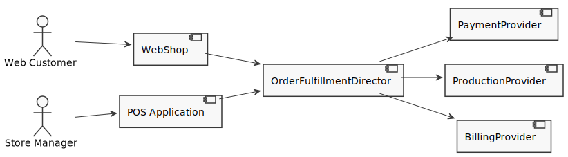

# Overview

In this kata you implement the Gang of Four Builder Pattern [[1](#ref-1), [2](#ref-2), [3](#ref-3)].

You are programming a shop system to sell clothes. The users of your system are store managers ordering items via an application on the point of sales computer of the stores (POS). In addition you provide a webshop for online sales. Both the POS and the webshop send the orders to a backend facade, the `OrderFulfillmentDirector`. This director then executes the steps to fulfill an order by delegating the work to special services.

Your task is to implement the high level backend `OrderFulfillmentDirector` for a clothes shop. The director shall have the method `FulfillOrder` which takes order details from the frontend. The `OrderFulfillmentDirector` has a `builder` member which implements the following steps needed to fulfill an order:

1. `CreateFulfilledOrder` initializes a new complex object `FulfilledOrder`
1. `GetFulfilledOrder` returns the current complex object `FulfilledOrder`
1. `ReservePayment` blocks the payment on the credit card. It fills in the field `FilledOrder.PaymentReferenceId` which it receives from the payment provider.
1. `ProduceAndShipOrder` instructs the factory to produce and ship the ordered items. It fills in the date of expected delivery into `FulfilledOrder.ProductionFinishedDateEstimate`.
1. `SendInvoiceAndHandlePayment` sends the invoice and allows to book a payment to order. Booking the payment may happen later, asynchronously. The method stores the `FulfilledOrder.InvoiceId` and later it updates `FulfilledOrder.IsPayed`.

## References

<a name="ref-1">[1]</a> David Starr and others: "The Builder Pattern" in "Pluralsight: Design Patterns Library", https://www.pluralsight.com/courses/patterns-library, last visited on Mar 18, 2020.

<a name="ref-2">[2]</a> Erich Gamma, Richard Helm, Ralph Johnson, John Vlissides: "Design Patterns: Elements of Reusable Object-Oriented Software", Addison Wesley, 1994, pp. 151ff, [ISBN 0-201-63361-2](https://en.wikipedia.org/wiki/Special:BookSources/0-201-63361-2).

<a name="ref-3">[3]</a> Wikipedia: "Bridge Pattern", https://en.wikipedia.org/wiki/Builder_pattern, last visited on Mar. 18, 2020.
